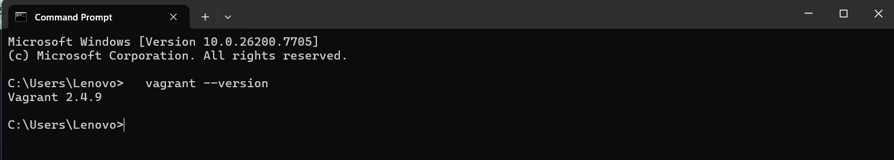
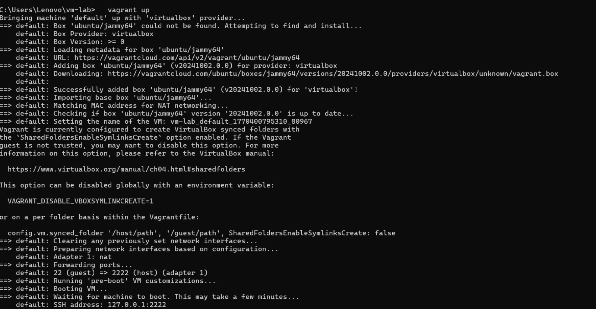
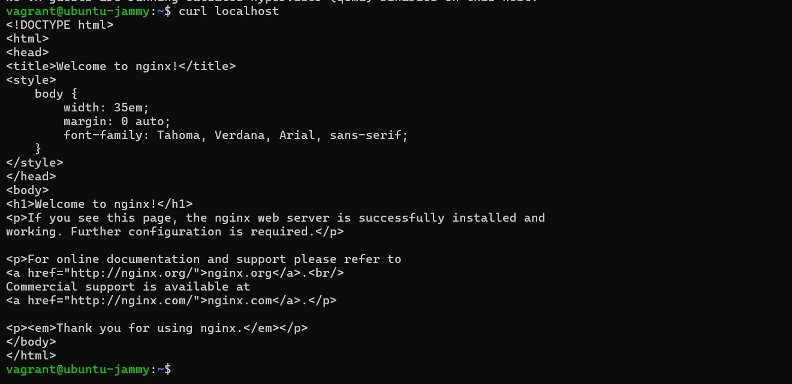

# Experiment 1: Comparison of Virtual Machine (VM) and Container

## Aim

To understand and compare the working of **Virtual Machines** and **Containers** by deploying the same application (Nginx web server) using both technologies and analyzing their behavior, resource usage, and deployment process.

---

## Part A: Virtual Machine Setup Using Vagrant

### Step 1: Verify Vagrant Installation

```bash
vagrant --version
```



*Figure 1: Verification of Vagrant installation on host machine.*

### Step 2: Create Project Directory

```bash
mkdir vm-lab
cd vm-lab
```

### Step 3: Initialize Vagrant with Ubuntu Box

```bash
vagrant init ubuntu/jammy64
```

### Step 4: Start the Virtual Machine

```bash
vagrant up
```



*Figure 2: Successful initialization and startup of Ubuntu VM using Vagrant.*

### Step 5: Access the VM

```bash
vagrant ssh
```

### Step 6: Install and Verify Nginx Inside VM

```bash
sudo apt update
sudo apt install nginx -y
curl localhost
```

**Output:** The default *Welcome to nginx!* HTML page is displayed, confirming that the web server is running successfully inside the virtual machine.



*Figure 3: Output confirming Nginx web server running inside the virtual machine.*

### Step 7: Stop and Destroy the VM

```bash
exit
vagrant halt
vagrant destroy
```

---

## Part B: Container Setup Using Docker

### Step 1: Verify Docker Installation

```bash
docker --version
```

### Step 2: Run Nginx Container

```bash
docker run -d -p 8080:80 nginx
```


*Figure 4: Nginx web server deployed using Docker container on port 8080.*

### Step 3: Verify Nginx Container

```bash
curl localhost:8080
```

Or access in browser:

```
http://localhost:8080
```

The *Welcome to nginx!* page confirms that Nginx is running inside a container.

### Step 4: Run Another Container on a Different Port

```bash
docker run -d -p 8081:80 nginx
```

Access:

```
http://localhost:8081
```

### Step 5: Manage Containers

```bash
docker ps
docker stop <container_id>
docker rm <container_id>
docker rmi nginx
```

---

## Observations

| Feature        | Virtual Machine   | Container             |
| -------------- | ----------------- | --------------------- |
| Boot Time      | Slow (minutes)    | Fast (seconds)        |
| OS Overhead    | Full Guest OS     | Shares Host OS Kernel |
| Resource Usage | High (RAM & CPU)  | Low (Lightweight)     |
| Isolation      | Strong (OS-level) | Process-level         |
| Deployment     | Heavy             | Lightweight           |

---

## Result

Both Virtual Machines and Containers were successfully deployed with the Nginx web server. The experiment demonstrated that containers are faster and more resource-efficient compared to virtual machines, while VMs provide stronger isolation.

---

## Conclusion

Virtual Machines are suitable when complete OS isolation is required, whereas containers are ideal for rapid deployment, scalability, and microservices architecture. Containers significantly reduce startup time and system overhead, making them more efficient for modern application deployment.

---