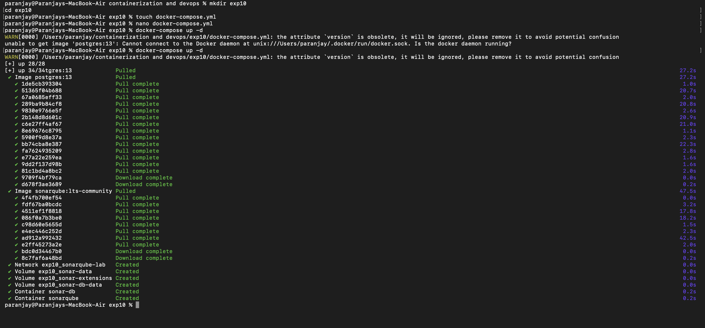
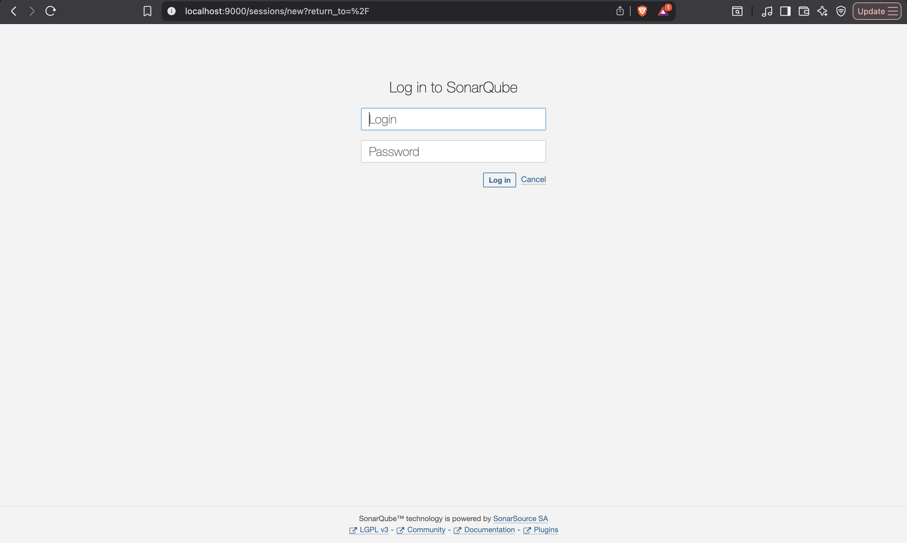
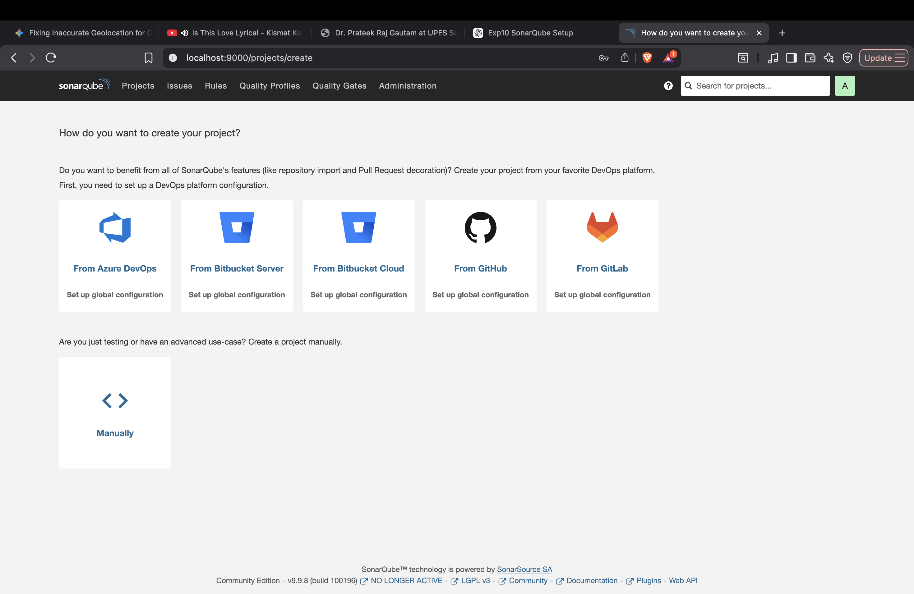
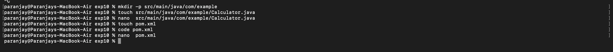
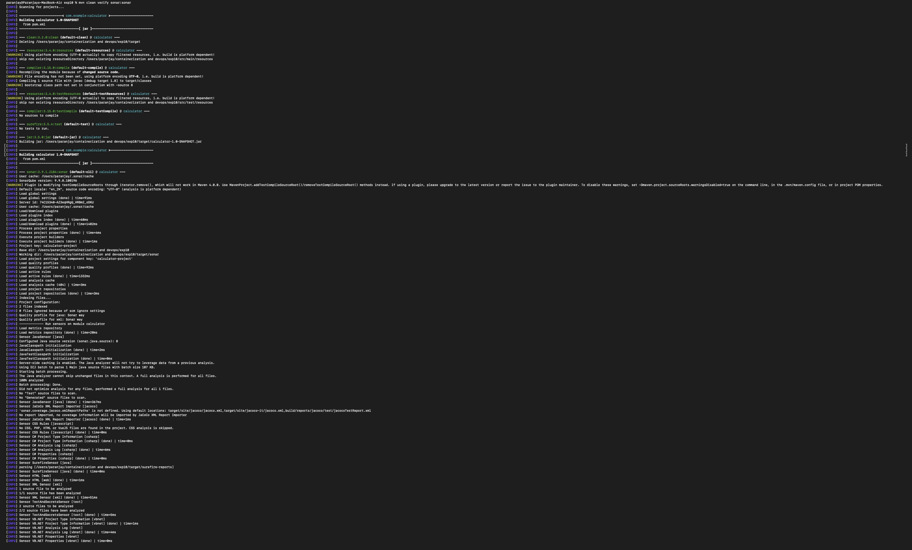
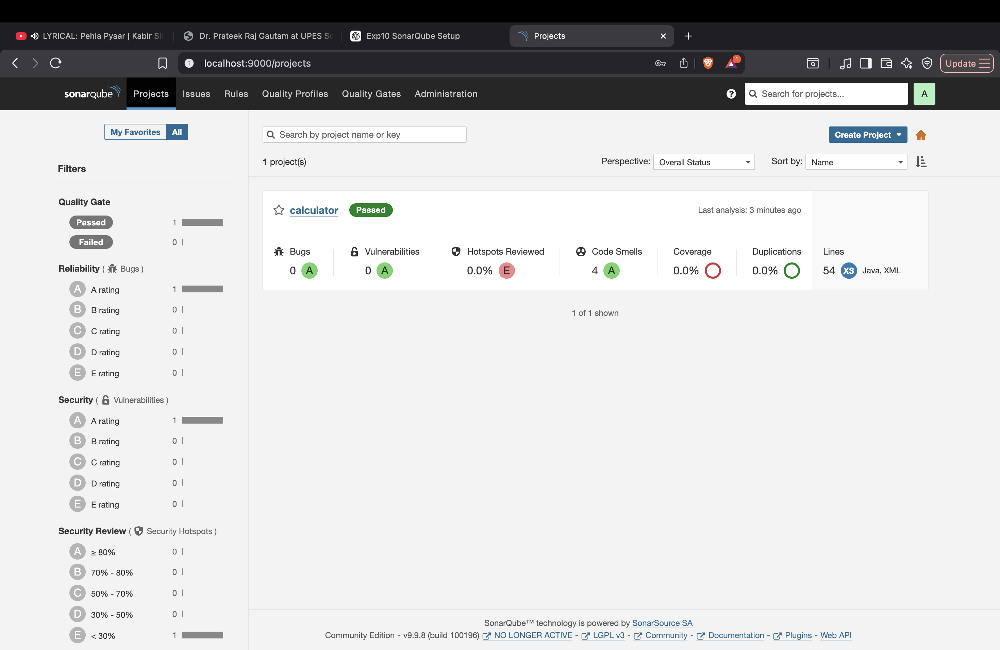
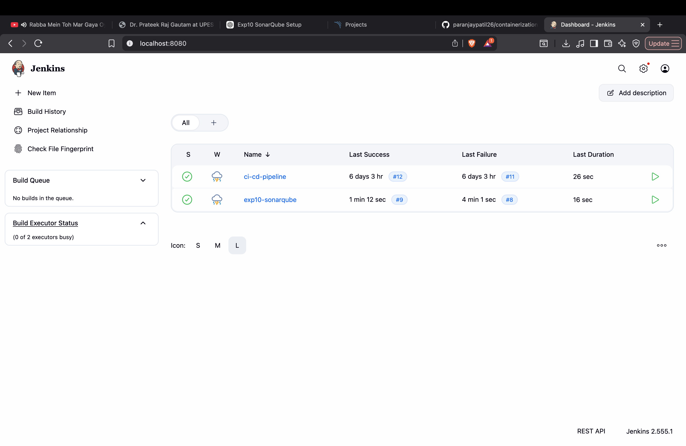

# Experiment 10: SonarQube with Jenkins Integration

## Aim

To perform static code analysis using SonarQube and integrate it with a Jenkins pipeline using Docker.

---

## Tools and Technologies

* Docker and Docker Compose
* SonarQube
* Jenkins
* Maven
* Java
* Git and GitHub

---

## Procedure

### 1. Setting up SonarQube using Docker

A `docker-compose.yml` file was created to run SonarQube along with a PostgreSQL database. The containers were started using:

```bash
docker-compose up -d
```

**Output (containers pulled and started):**


---

### 2. Verifying SonarQube Server

The SonarQube server was accessed in the browser at:

http://localhost:9000

The login page confirms the server is running.



---

### 3. Creating a Project in SonarQube

A new project was created manually from the SonarQube UI.



---

### 4. Creating a Sample Java Project

A simple Maven-based Java project was created with the following structure:

* `src/main/java/com/example/Calculator.java`
* `pom.xml` configured for SonarQube analysis



---

### 5. Running SonarQube Analysis

The project was analyzed using Maven:

```bash
mvn clean verify sonar:sonar
```

The build and analysis logs were generated successfully.



---

### 6. Viewing Analysis Results in SonarQube

The project appeared in the SonarQube dashboard with analysis results such as bugs, vulnerabilities, and code smells.



---

### 7. Jenkins Integration

A Jenkins pipeline was created to automate the build and SonarQube analysis process.



---

## Result

The Java project was successfully analyzed using SonarQube. Jenkins was used to automate the analysis process, demonstrating integration of code quality checks into a CI/CD pipeline.

---

## Conclusion

This experiment demonstrates how SonarQube can be used for static code analysis and how it can be integrated with Jenkins to automate quality checks. This approach helps identify issues early and improves overall code quality in a development workflow.

