# Experiment 11: Container Orchestration using Docker Swarm

## Objective

The objective of this experiment is to understand container orchestration and implement it using Docker Swarm. The experiment demonstrates how to deploy a multi-container application, scale services, and observe self-healing behavior.

---

## Prerequisites

* Docker Desktop installed and running
* Basic understanding of Docker and Docker Compose
* `docker-compose.yml` file from Experiment 6

---

## Step 1: Create Project Directory

A new directory is created for the experiment, and the compose file from Experiment 6 is copied into it.

```bash
mkdir exp11
cd exp11
cp ../exp6/docker-compose.yml .
```

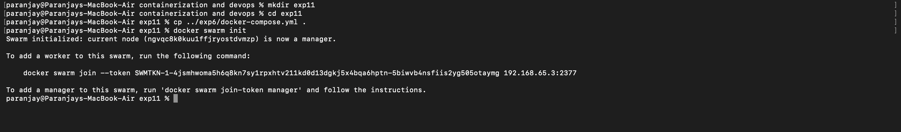

---

## Step 2: Initialize Docker Swarm

Docker Swarm mode is initialized to enable orchestration.

```bash
docker swarm init
```

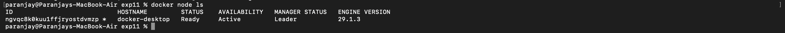

---

## Step 3: Verify Swarm Node

Check whether the system is acting as a manager node.

```bash
docker node ls
```

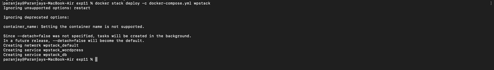

---

## Step 4: Deploy Stack

The application is deployed as a stack using the Docker Compose file.

```bash
docker stack deploy -c docker-compose.yml wpstack
```

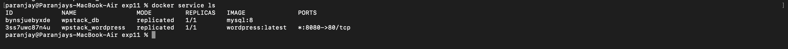

---

## Step 5: Verify Services

List all services created by the stack.

```bash
docker service ls
```

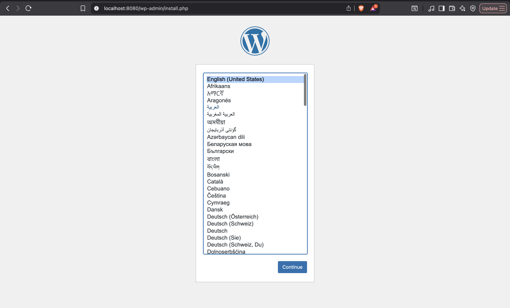

---

## Step 6: Access the Application

Open the application in a browser.

```
http://localhost:8080
```

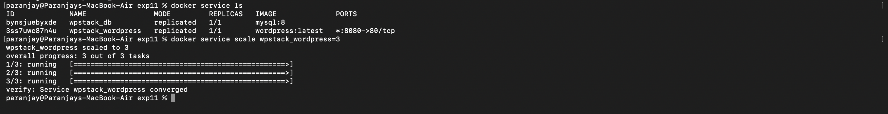

---

## Step 7: Scale the Service

Increase the number of WordPress containers from 1 to 3.

```bash
docker service scale wpstack_wordpress=3
```

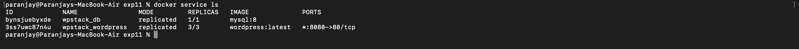

---

## Step 8: Verify Scaling

Check if the number of replicas has increased.

```bash
docker service ls
```

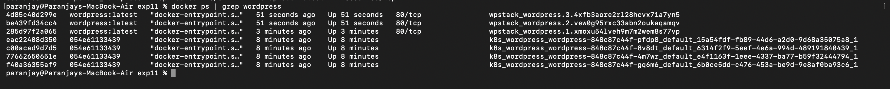

---

## Step 9: Check Running Containers

Verify that multiple WordPress containers are running.

```bash
docker ps | grep wordpress
```

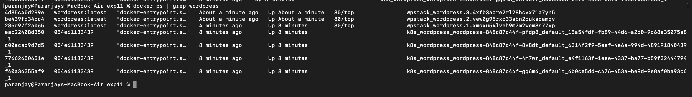

---

## Step 10: Test Self-Healing

Stop one of the running containers manually.

```bash
docker kill <container-id>
```

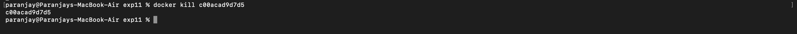

---

## Step 11: Verify Self-Healing

Docker Swarm automatically recreates the container to maintain the desired state.

```bash
docker service ps wpstack_wordpress
```


---

## Step 12: Final Verification

Check all running containers again.

```bash
docker ps
```

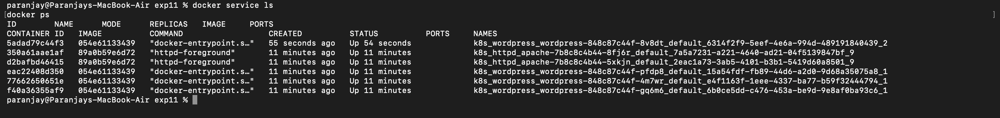

---

## Result

The application was successfully deployed using Docker Swarm.
Scaling and self-healing functionalities were tested and verified.

---

## Conclusion

Docker Swarm provides a simple way to manage containerized applications in a clustered environment. It ensures high availability by automatically replacing failed containers and supports scaling with minimal effort.

---

## Key Learnings

* Docker Swarm manages services rather than individual containers
* Scaling services can be done using a single command
* Failed containers are automatically recreated
* Load balancing is handled internally

---

## Commands Summary

```bash
docker swarm init
docker node ls
docker stack deploy -c docker-compose.yml wpstack
docker service ls
docker service scale wpstack_wordpress=3
docker service ps wpstack_wordpress
docker stack rm wpstack
```
