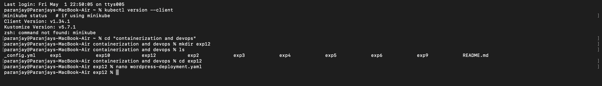
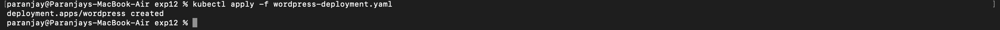
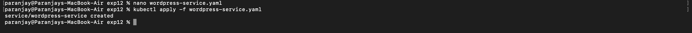
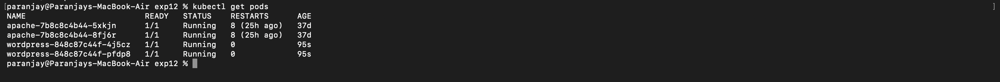
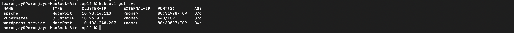
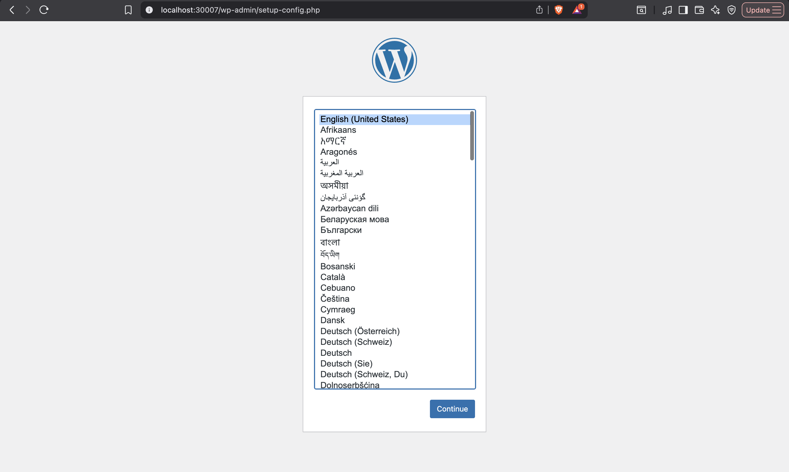
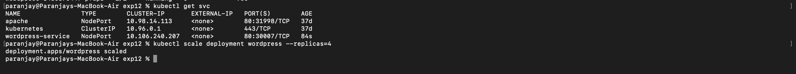
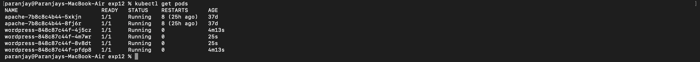
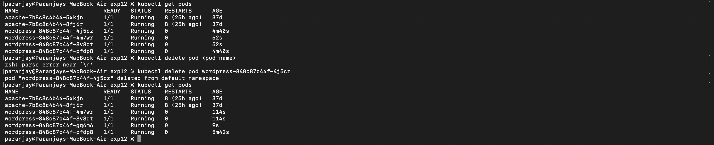

# Experiment 12: Study and Analyse Container Orchestration using Kubernetes

## Objective
To understand the basic concepts of Kubernetes and perform deployment, service exposure, scaling, and self-healing of applications.

---

## Introduction

Kubernetes is a container orchestration platform used to manage containerized applications efficiently. It automates deployment, scaling, and maintenance of applications. It is widely used in industry due to its reliability and flexibility.

---

## Key Concepts

- Pod: The smallest unit in Kubernetes that contains one or more containers.
- Deployment: Manages application instances and ensures the desired number of pods are running.
- Service: Exposes the application to external users or other services.
- ReplicaSet: Maintains a fixed number of running pods.

---

## Procedure

### Step 1: Verify Kubernetes Setup

```bash
kubectl version --client
````

**Output Screenshot:**



---

### Step 2: Create Deployment

Create a file named `wordpress-deployment.yaml`:

```yaml id="h5f3b9"
apiVersion: apps/v1
kind: Deployment
metadata:
  name: wordpress
spec:
  replicas: 2
  selector:
    matchLabels:
      app: wordpress
  template:
    metadata:
      labels:
        app: wordpress
    spec:
      containers:
      - name: wordpress
        image: wordpress:latest
        ports:
        - containerPort: 80
```

Apply the deployment:

```bash id="c2d9ra"
kubectl apply -f wordpress-deployment.yaml
```

**Output Screenshot:**



---

### Step 3: Create Service

Create a file named `wordpress-service.yaml`:

```yaml id="p9y6tb"
apiVersion: v1
kind: Service
metadata:
  name: wordpress-service
spec:
  type: NodePort
  selector:
    app: wordpress
  ports:
    - port: 80
      targetPort: 80
      nodePort: 30007
```

Apply the service:

```bash id="w3k7zn"
kubectl apply -f wordpress-service.yaml
```

**Output Screenshot:**



---

### Step 4: Verify Pods

```bash id="s8r4xm"
kubectl get pods
```

**Output Screenshot:**



---

### Step 5: Verify Service

```bash id="n6t2pl"
kubectl get svc
```

**Output Screenshot:**



---

### Step 6: Access Application

Open the following URL in your browser:

```id="m4x8qa"
http://localhost:30007
```

**Output Screenshot:**



---

### Step 7: Scale Deployment

```bash id="d1z7cv"
kubectl scale deployment wordpress --replicas=4
```

**Output Screenshot:**



---

### Step 8: Verify Scaling

```bash id="b5k9yu"
kubectl get pods
```

**Output Screenshot:**



---

### Step 9: Self-Healing Test

Delete a pod:

```bash id="q2w8eo"
kubectl delete pod <pod-name>
```

Verify again:

```bash id="x7c4vn"
kubectl get pods
```

**Output Screenshot:**



---

## Result

* Successfully deployed a WordPress application using Kubernetes
* Exposed the application using a service
* Scaled the application from 2 to 4 pods
* Demonstrated self-healing capability

---

## Conclusion

Kubernetes simplifies the management of containerized applications by providing features such as automatic scaling, load balancing, and self-healing. It is widely used in industry for deploying and managing modern applications.

````

---

