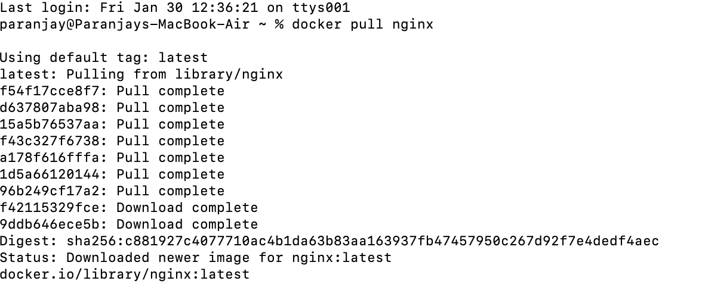
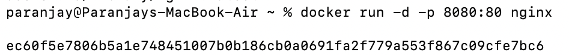
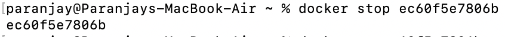
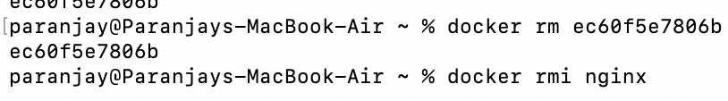
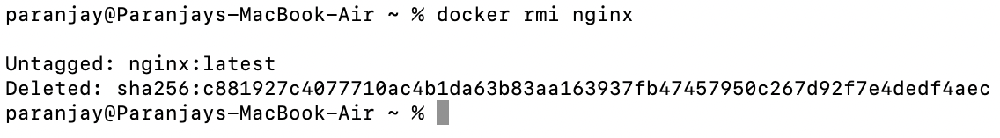

# 🐳 Experiment 2: Docker Installation, Configuration and Running Images

---

## 📌 Aim

To install and configure Docker on the host system and understand Docker basics by pulling images, running containers, managing container lifecycle, and performing port mapping using Docker commands.

---

## 🖥️ System Details

- **Operating System:** macOS  
- **Tool Used:** Docker Desktop  
- **Image Used:** nginx:latest  

---

# 🚀 Implementation Steps

---

## 🔹 Step 1: Verify Docker Installation

```bash
docker --version
```

**Output:**  
Displays Docker version confirming successful installation.

---

## 🔹 Step 2: Pull Nginx Image from Docker Hub

```bash
docker pull nginx
```

**Output:**  
The official Nginx image is downloaded successfully.

📷 Screenshot:



---

## 🔹 Step 3: Run Nginx Container

```bash
docker run -d -p 8081:80 nginx
```

### Explanation:
- `-d` → Runs container in detached mode  
- `-p 8081:80` → Maps host port 8081 to container port 80  
- `nginx` → Docker image name  

📷 Screenshot:



---

## 🔹 Step 4: List Running Containers

```bash
docker ps
```

**Output:**  
Displays container ID, image name, status, ports, and container name.

📷 Screenshot:


---

## 🔹 Step 5: Access Nginx Web Server

Open browser and visit:

```
http://localhost:8081
```

**Output:**  
The default *Welcome to nginx!* page is displayed.

📷 Screenshot:



---

## 🔹 Step 6: Stop Running Container

```bash
docker stop <container_id>
```

📷 Screenshot:


---

## 🔹 Step 7: Remove Container

```bash
docker rm <container_id>
```

📷 Screenshot:



---

## 🔹 Step 8: Remove Docker Image

```bash
docker rmi nginx
```

📷 Screenshot:



---

# 📊 Observations

| Feature | Observation |
|----------|-------------|
| Image Download | Successful |
| Startup Time | Very Fast |
| Resource Usage | Low |
| Port Mapping | Browser accessible |
| Container Control | Easy via CLI |

---

# ✅ Result

Docker was successfully installed and configured.  
The Nginx image was pulled and executed as a container.  
All container management operations were performed successfully.

---

# 🎯 Conclusion

Docker provides lightweight and efficient application deployment using containers. Compared to traditional virtual machines, Docker containers:

- Start faster  
- Use fewer resources  
- Are portable across systems  
- Simplify deployment  

---


