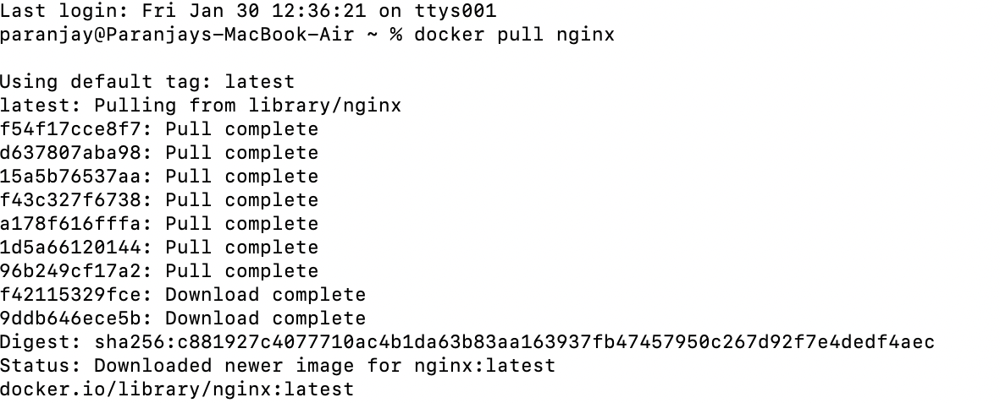
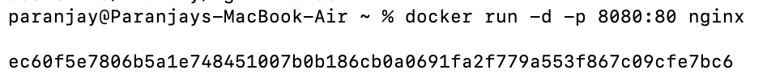
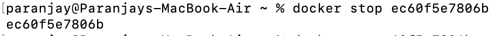
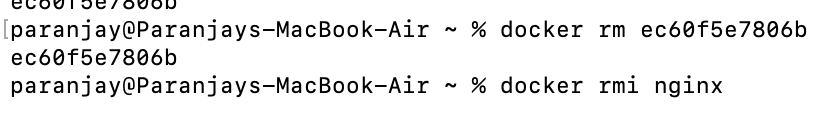
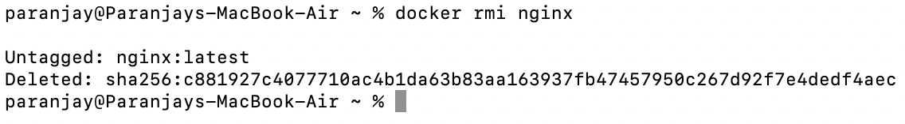

# Experiment 2: Docker Installation, Configuration and Running Images

---

## Aim

To install and configure Docker on the host system and understand basic Docker operations such as pulling images, running containers, managing the container lifecycle, and performing port mapping using Docker commands.

---

## System Details

* **Operating System:** macOS
* **Tool Used:** Docker Desktop
* **Image Used:** nginx:latest

---

## Implementation Steps

---

### Step 1: Verify Docker Installation

```bash
docker --version
```

**Output:**
Displays the installed Docker version, confirming successful installation.

---

### Step 2: Pull Nginx Image from Docker Hub

```bash
docker pull nginx
```

**Output:**
The official Nginx image is downloaded successfully from Docker Hub.

Screenshot:



---

### Step 3: Run Nginx Container

```bash
docker run -d -p 8081:80 nginx
```

**Explanation:**

* `-d` runs the container in detached mode
* `-p 8081:80` maps port 8081 on the host to port 80 in the container
* `nginx` specifies the image to run

Screenshot:



---

### Step 4: List Running Containers

```bash
docker ps
```

**Output:**
Displays details such as container ID, image name, status, ports, and container name.

Screenshot:


---

### Step 5: Access Nginx Web Server

Open a web browser and visit:

```
http://localhost:8081
```

**Output:**
The default "Welcome to nginx!" page is displayed in the browser.

Screenshot:



---

### Step 6: Stop Running Container

```bash
docker stop <container_id>
```

Screenshot:


---

### Step 7: Remove Container

```bash
docker rm <container_id>
```

Screenshot:



---

### Step 8: Remove Docker Image

```bash
docker rmi nginx
```

Screenshot:



---

## Observations

| Feature              | Observation             |
| -------------------- | ----------------------- |
| Image Download       | Successful              |
| Startup Time         | Very fast               |
| Resource Usage       | Low                     |
| Port Mapping         | Accessible via browser  |
| Container Management | Easy using CLI commands |

---

## Result

Docker was successfully installed and configured on the system.
The Nginx image was pulled and executed as a container.
Basic container operations such as running, stopping, removing, and port mapping were performed successfully.

---

## Conclusion

Docker provides a lightweight and efficient way to deploy applications using containers. Compared to traditional virtual machines, containers:

* Start quickly
* Use fewer system resources
* Are portable across different environments
* Simplify the deployment process

---
