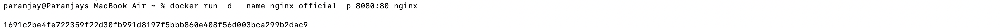
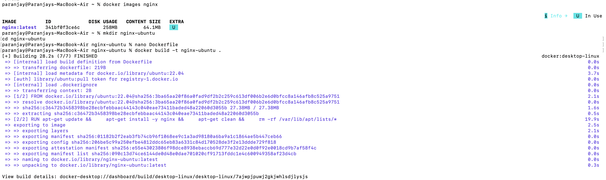
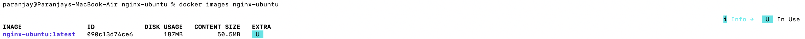
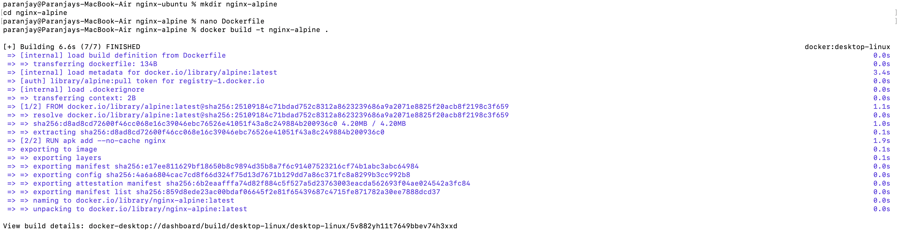
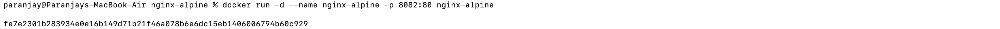
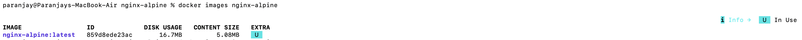

<<<<<<< HEAD
# 🐳 Experiment 3: Building and Comparing Nginx Docker Images

---

## 📌 Aim

To:

- Pull and run the official Nginx image  
- Build custom Nginx images using Ubuntu and Alpine  
- Compare image sizes  
- Analyze Docker layers  
- Deploy custom HTML using volume mounting  

---

# 🚀 Step 1: Pull Official Nginx Image

```bash
docker pull nginx:latest
```

📷 Screenshot:


---

# 🚀 Step 2: Run Official Nginx Container

```bash
docker run -d --name nginx-official -p 8080:80 nginx
```

📷 Screenshot:



---

# 🚀 Step 3: Check Official Image Size

```bash
docker images nginx
```

📷 Screenshot:



---

# 🏗 Step 4: Build Nginx Using Ubuntu Base Image

## Create Folder

```bash
mkdir nginx-ubuntu
cd nginx-ubuntu
```

## Dockerfile (Ubuntu)

```dockerfile
FROM ubuntu:22.04
RUN apt-get update && \
    apt-get install -y nginx && \
    apt-get clean && \
    rm -rf /var/lib/apt/lists/*
CMD ["nginx", "-g", "daemon off;"]
```

## Build Image

```bash
docker build -t nginx-ubuntu .
```

📷 Screenshot:


## Run Container

```bash
docker run -d --name nginx-ubuntu -p 8081:80 nginx-ubuntu
```

📷 Screenshot:



## Check Image Size

```bash
docker images nginx-ubuntu
```

📷 Screenshot:



---

# 🏗 Step 5: Build Nginx Using Alpine Base Image

## Create Folder

```bash
mkdir nginx-alpine
cd nginx-alpine
```

## Dockerfile (Alpine)

```dockerfile
FROM alpine:latest
RUN apk add --no-cache nginx
CMD ["nginx", "-g", "daemon off;"]
```

## Build Image

```bash
docker build -t nginx-alpine .
```

📷 Screenshot:



## Run Container

```bash
docker run -d --name nginx-alpine -p 8082:80 nginx-alpine
```

📷 Screenshot:



## Check Image Size

```bash
docker images nginx-alpine
```

📷 Screenshot:


---

# 📊 Step 6: Compare All Images

```bash
docker images | grep nginx
```

📷 Screenshot:


---

# 🔍 Step 7: Analyze Image Layers

```bash
docker history nginx
docker history nginx-ubuntu
docker history nginx-alpine
```

📷 Screenshot:


---

# 📂 Step 8: Volume Mounting Custom HTML

## Create HTML Folder

```bash
mkdir html
echo "<h1>Hello from Docker NGINX</h1>" > html/index.html
```

## Run Container with Volume

```bash
docker run -d \
-p 8083:80 \
-v $(pwd)/html:/usr/share/nginx/html \
nginx
```

Open:

```
http://localhost:8083
```

✔ Custom HTML page is displayed.

---

# 📈 Observations

| Image Type | Size | Performance | Use Case |
|------------|------|------------|----------|
| Official Nginx | 258MB | Optimized | Production |
| Ubuntu Based | 187MB | Moderate | Customization |
| Alpine Based | 16.7MB | Lightweight | Minimal Deployments |

---

# ✅ Result

Successfully:

- Pulled official Nginx image  
- Built custom Ubuntu and Alpine images  
- Compared image sizes  
- Analyzed image layers  
- Implemented volume mounting  

---

# 🎯 Conclusion

- Alpine images are significantly smaller and more efficient.
- Ubuntu images provide flexibility but increase size.
- Docker layering impacts final image size.
- Volume mounting allows dynamic content updates without rebuilding.

---

# 📂 Project Structure

```
exp3/
│
├── nginx-ubuntu/
│   └── Dockerfile
│
├── nginx-alpine/
│   └── Dockerfile
│
├── html/
│   └── index.html
│
├── screenshots/
│   ├── image1.png
│   ├── image2.png
│   ├── image3.png
│   ├── image4.png
│   ├── image5.png
│   ├── image6.png
│   ├── image7.png
│   ├── image8.png
│   ├── image9.png
│   ├── image10.png
│   └── image11.png
│
└── README.md
```

---


=======
# 🐳 Experiment 3: Building and Comparing Nginx Docker Images

---

## 📌 Aim

To:

- Pull and run the official Nginx image  
- Build custom Nginx images using Ubuntu and Alpine  
- Compare image sizes  
- Analyze Docker layers  
- Deploy custom HTML using volume mounting  

---

# 🚀 Step 1: Pull Official Nginx Image

```bash
docker pull nginx:latest
```

📷 Screenshot:


---

# 🚀 Step 2: Run Official Nginx Container

```bash
docker run -d --name nginx-official -p 8080:80 nginx
```

📷 Screenshot:


---

# 🚀 Step 3: Check Official Image Size

```bash
docker images nginx
```

📷 Screenshot:


---

# 🏗 Step 4: Build Nginx Using Ubuntu Base Image

## Create Folder

```bash
mkdir nginx-ubuntu
cd nginx-ubuntu
```

## Dockerfile (Ubuntu)

```dockerfile
FROM ubuntu:22.04
RUN apt-get update && \
    apt-get install -y nginx && \
    apt-get clean && \
    rm -rf /var/lib/apt/lists/*
CMD ["nginx", "-g", "daemon off;"]
```

## Build Image

```bash
docker build -t nginx-ubuntu .
```

📷 Screenshot:


## Run Container

```bash
docker run -d --name nginx-ubuntu -p 8081:80 nginx-ubuntu
```

📷 Screenshot:


## Check Image Size

```bash
docker images nginx-ubuntu
```

📷 Screenshot:


---

# 🏗 Step 5: Build Nginx Using Alpine Base Image

## Create Folder

```bash
mkdir nginx-alpine
cd nginx-alpine
```

## Dockerfile (Alpine)

```dockerfile
FROM alpine:latest
RUN apk add --no-cache nginx
CMD ["nginx", "-g", "daemon off;"]
```

## Build Image

```bash
docker build -t nginx-alpine .
```

📷 Screenshot:


## Run Container

```bash
docker run -d --name nginx-alpine -p 8082:80 nginx-alpine
```

📷 Screenshot:


## Check Image Size

```bash
docker images nginx-alpine
```

📷 Screenshot:


---

# 📊 Step 6: Compare All Images

```bash
docker images | grep nginx
```

📷 Screenshot:


---

# 🔍 Step 7: Analyze Image Layers

```bash
docker history nginx
docker history nginx-ubuntu
docker history nginx-alpine
```

📷 Screenshot:


---

# 📂 Step 8: Volume Mounting Custom HTML

## Create HTML Folder

```bash
mkdir html
echo "<h1>Hello from Docker NGINX</h1>" > html/index.html
```

## Run Container with Volume

```bash
docker run -d \
-p 8083:80 \
-v $(pwd)/html:/usr/share/nginx/html \
nginx
```

Open:

```
http://localhost:8083
```

✔ Custom HTML page is displayed.

---

# 📈 Observations

| Image Type | Size | Performance | Use Case |
|------------|------|------------|----------|
| Official Nginx | 258MB | Optimized | Production |
| Ubuntu Based | 187MB | Moderate | Customization |
| Alpine Based | 16.7MB | Lightweight | Minimal Deployments |

---

# ✅ Result

Successfully:

- Pulled official Nginx image  
- Built custom Ubuntu and Alpine images  
- Compared image sizes  
- Analyzed image layers  
- Implemented volume mounting  

---

# 🎯 Conclusion

- Alpine images are significantly smaller and more efficient.
- Ubuntu images provide flexibility but increase size.
- Docker layering impacts final image size.
- Volume mounting allows dynamic content updates without rebuilding.

---

# 📂 Project Structure

```
exp3/
│
├── nginx-ubuntu/
│   └── Dockerfile
│
├── nginx-alpine/
│   └── Dockerfile
│
├── html/
│   └── index.html
│
├── screenshots/
│   ├── image1.png
│   ├── image2.png
│   ├── image3.png
│   ├── image4.png
│   ├── image5.png
│   ├── image6.png
│   ├── image7.png
│   ├── image8.png
│   ├── image9.png
│   ├── image10.png
│   └── image11.png
│
└── README.md
```

---
>>>>>>> b3ed93b (Added Docker experiment README and screenshots)
