# 🚀 Experiment 6A: Docker Run vs Docker Compose

## 📌 Objective
To understand the difference between Docker Run and Docker Compose and implement both approaches.

---

# 🔹 Task 1: Single Container using Docker Run

## Step 1: Create Project Directory


---

## Step 2: Run Nginx Container

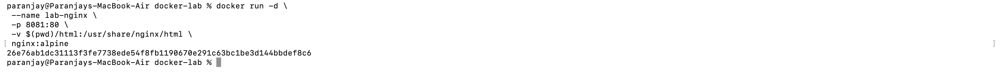

---

## Step 3: Verify Running Container

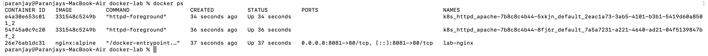

---

## Step 4: Access in Browser

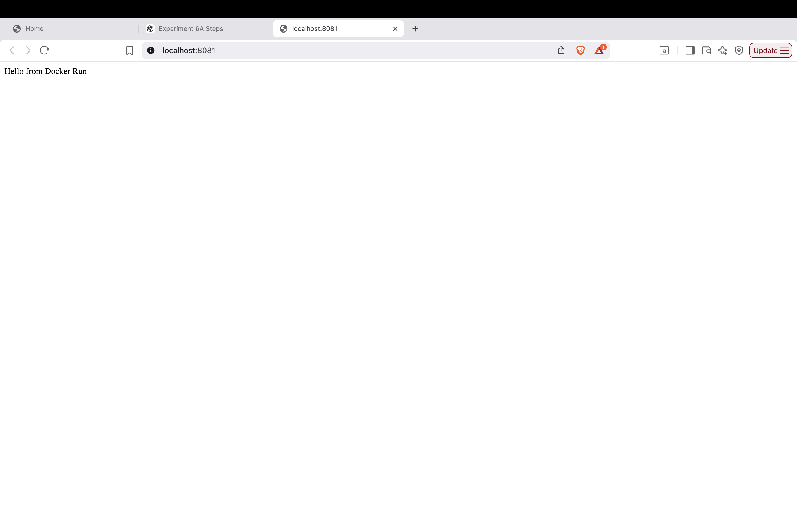

---

## Step 5: Stop Container

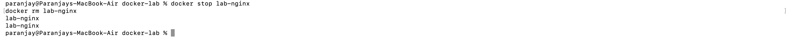

---

# 🔹 Task 1: Using Docker Compose

## Step 6: Create docker-compose.yml and Run

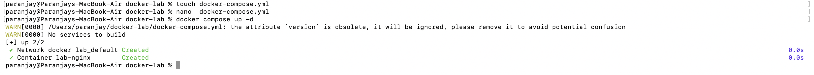

---

## Step 7: Verify and Stop

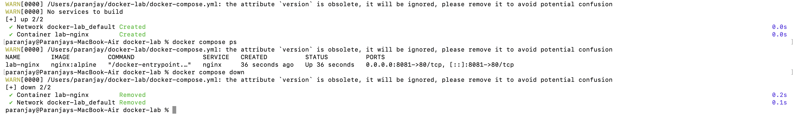

---

# 🔹 Task 2: Multi-Container (WordPress + MySQL)

## Step 8: Create Network

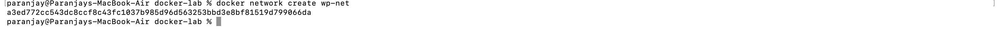

---

## Step 9: Run MySQL and WordPress Containers

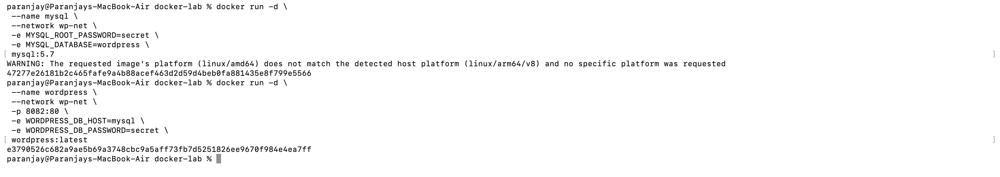

---

## Step 10: WordPress Setup Page


---

# 🔹 Task 2: Using Docker Compose

## Step 11: Run using Compose

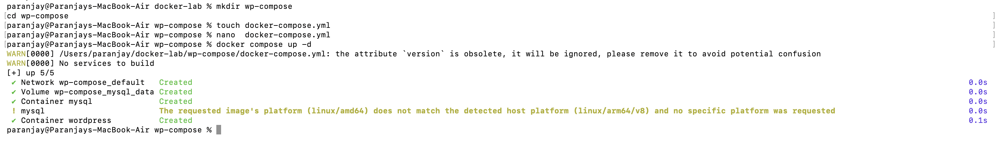

---

## Step 12: WordPress Running

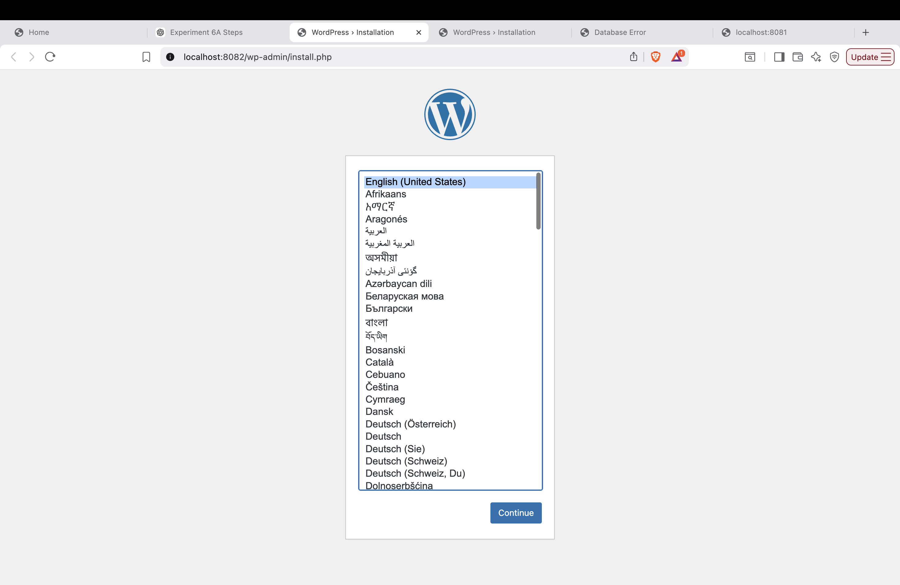

---

## Step 13: Stop and Remove Containers

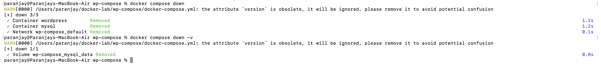

---

# 🔹 Task 5: Dockerfile + Docker Compose (Node App)

## Step 14: Create Files

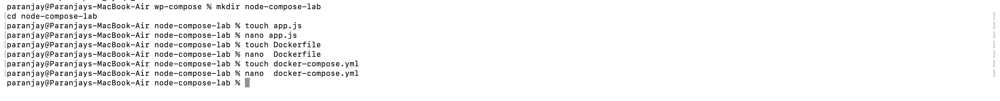

---

## Step 15: Build and Run Application

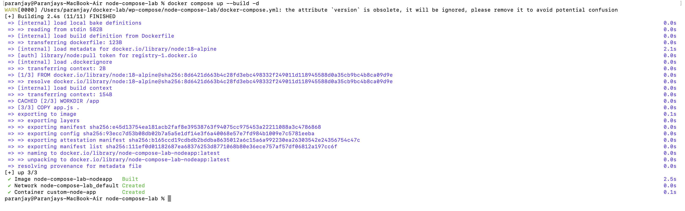

---

## Step 16: Verify Running Container

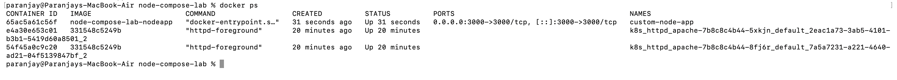

---

## Step 17: Output in Browser


---

# 🧠 Conclusion

- Docker Run is **imperative** (manual commands)
- Docker Compose is **declarative** (configuration-based)
- Compose simplifies multi-container applications
- Dockerfile allows custom image creation

---

# 🎯 Key Learning

- Container networking using service names
- Volume persistence
- Multi-container orchestration
- Image build vs prebuilt image usage

---

# ⚡ Commands Summary

```bash
docker run
docker compose up -d
docker compose down
docker compose up --build -d