# Experiment 9: Ansible Automation using Docker Containers

## Aim

To automate the configuration of multiple Docker-based servers using Ansible.

---

## Objective

* Install and configure Ansible
* Create Docker containers as servers
* Establish SSH connectivity
* Create inventory file
* Execute Ansible commands
* Run playbook for automation

---

## Tools Used

* Docker
* Ansible
* Python (Virtual Environment)
* Ubuntu

---

## Step 1: Create Virtual Environment and Install Ansible

```bash
python3 -m venv ansible-env
source ansible-env/bin/activate
pip install ansible
```

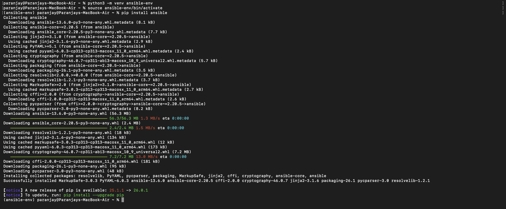

---

## Step 2: Verify Installation

```bash
ansible --version
```

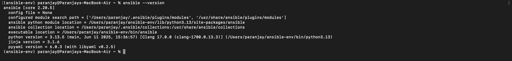

---

## Step 3: Test Ansible Connection

```bash
ansible localhost -m ping
```

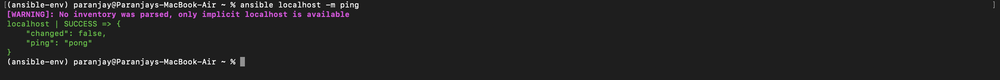

---

## Step 4: Generate SSH Key

```bash
ssh-keygen -t rsa -b 4096
```

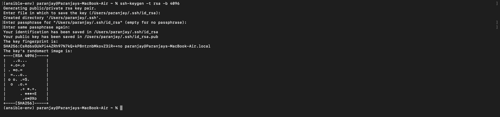

---

## Step 5: Build Docker Image

```bash
docker build -t ubuntu-server .
```


---

## Step 6: Run Docker Container

```bash
docker run -d -p 2222:22 --name ssh-test-server ubuntu-server
```

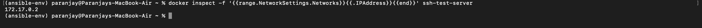

---

## Step 7: Get Container IP

```bash
docker inspect -f '{{range.NetworkSettings.Networks}}{{.IPAddress}}{{end}}' ssh-test-server
```

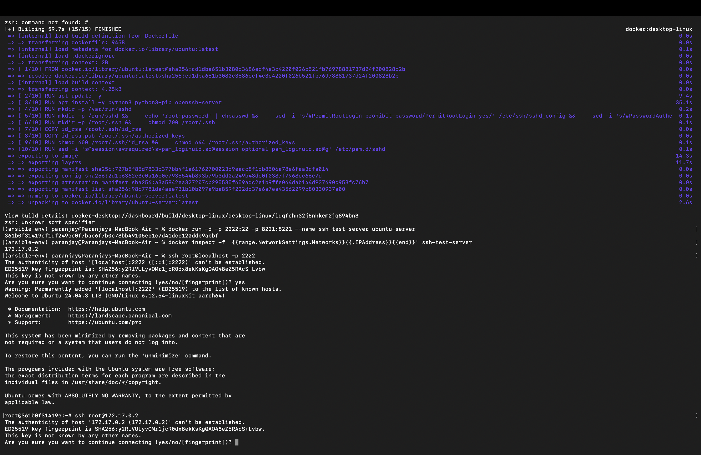

---

## Step 8: Connect via SSH

```bash
ssh root@localhost -p 2222
```

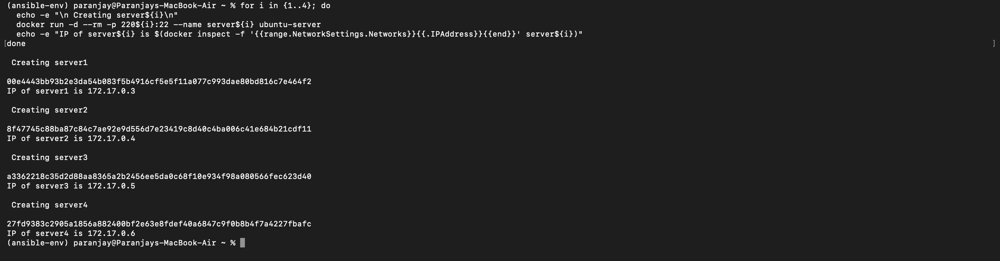

---

## Step 9: Create Multiple Servers

```bash
for i in {1..4}; do
  docker run -d -p 220${i}:22 --name server${i} ubuntu-server
done
```

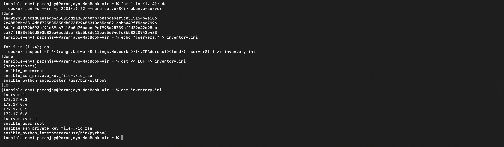

---

## Step 10: Create Inventory File

```bash
echo "[servers]" > inventory.ini

for i in {1..4}; do
  docker inspect -f '{{range.NetworkSettings.Networks}}{{.IPAddress}}{{end}}' server${i} >> inventory.ini
done

cat << EOF >> inventory.ini
[servers:vars]
ansible_user=root
ansible_ssh_private_key_file=./id_rsa
ansible_python_interpreter=/usr/bin/python3
EOF
```


---

## Step 11: Test All Servers

```bash
ansible all -i inventory.ini -m ping
```

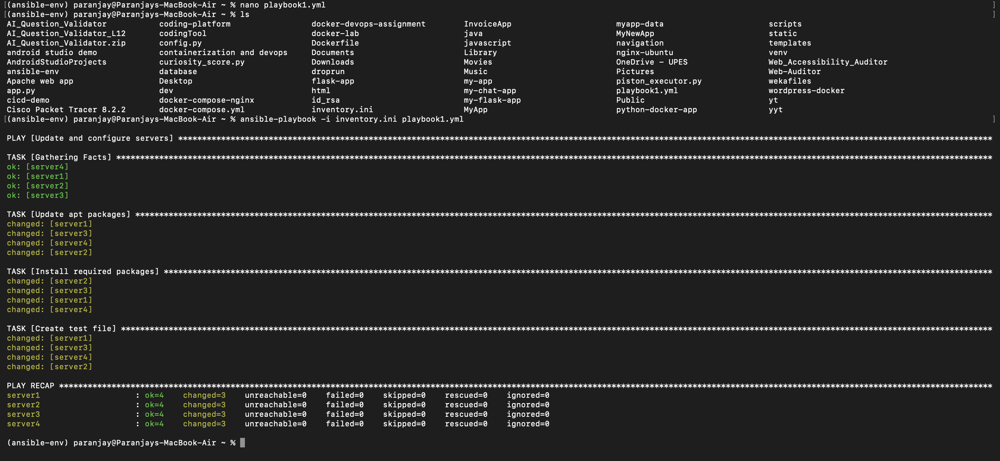

---

## Step 12: Create Playbook

```yaml
- name: Update and configure servers
  hosts: servers
  become: yes

  tasks:
    - name: Update apt packages
      apt:
        update_cache: yes

    - name: Install required packages
      apt:
        name: python3
        state: present

    - name: Create test file
      copy:
        content: "Configured by Ansible"
        dest: /root/ansible_test.txt
```

---

## Step 13: Run Playbook

```bash
ansible-playbook -i inventory.ini playbook1.yml
```

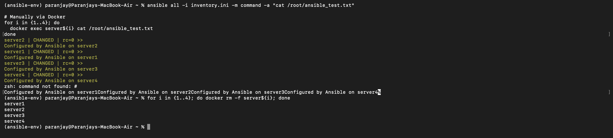

---

## Step 14: Verify Output

```bash
ansible all -i inventory.ini -m command -a "cat /root/ansible_test.txt"
```

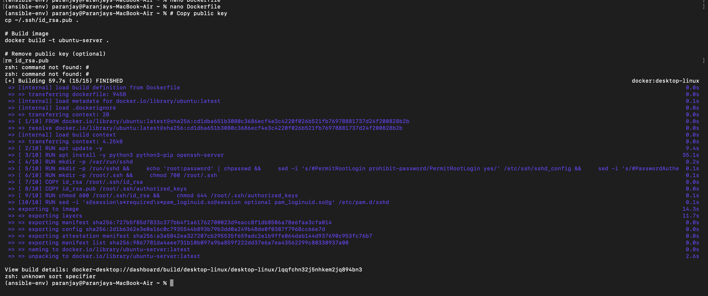

---

## Result

Successfully automated multiple Docker containers using Ansible. All servers were configured and verified using playbook execution.

---
